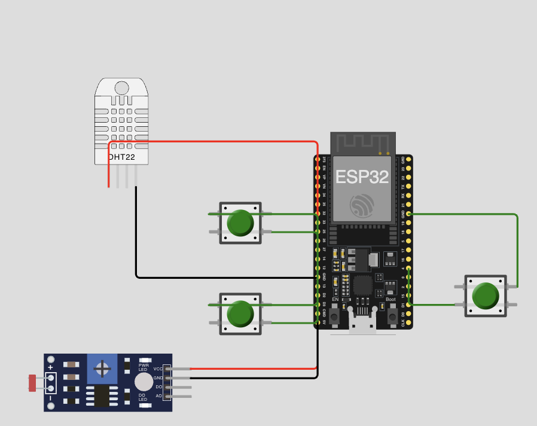
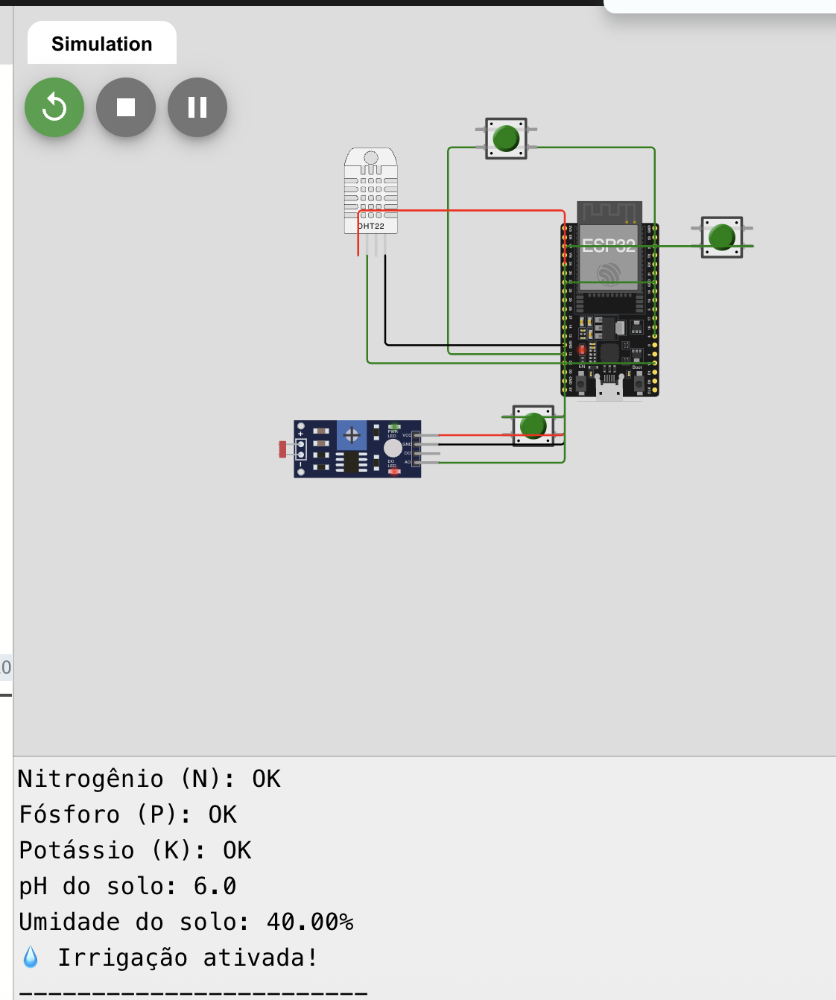
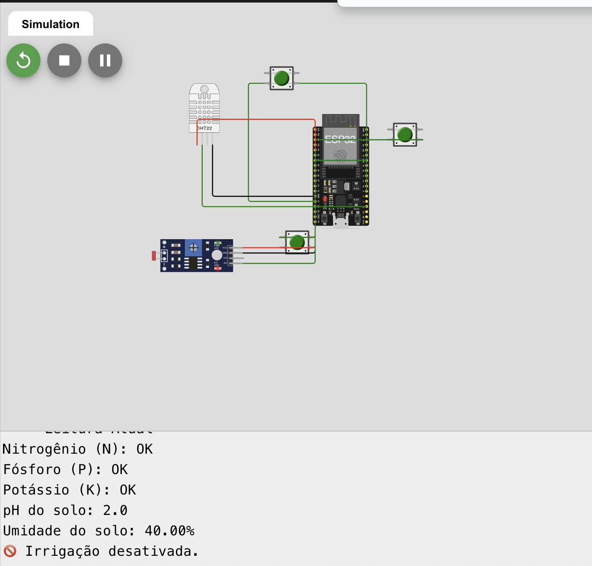
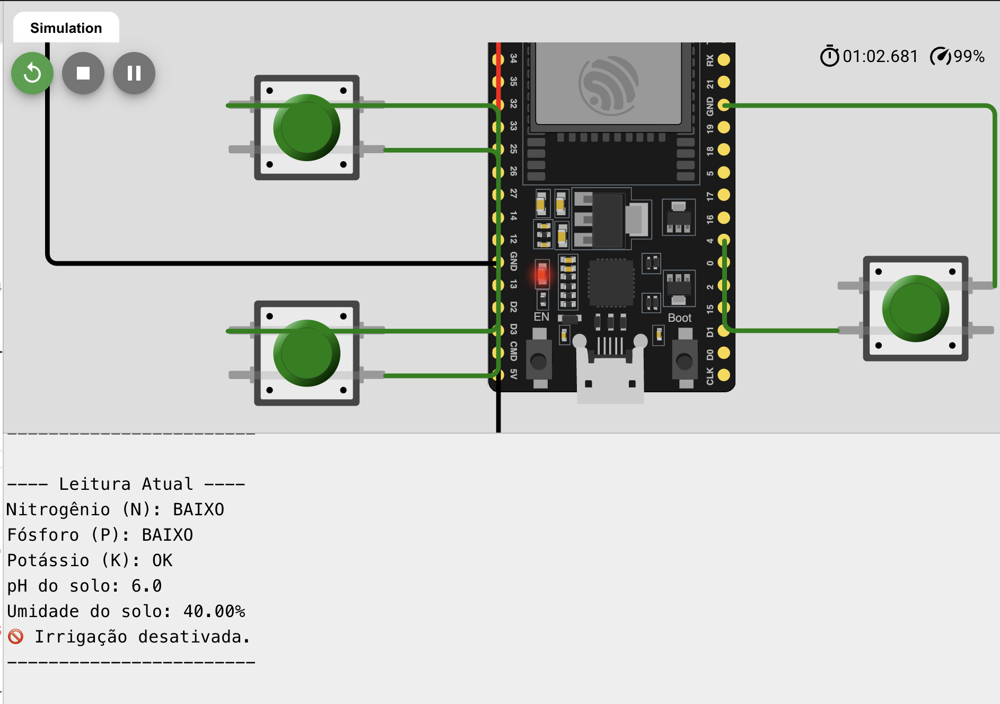

# 🌾 FarmTech Solutions – Fase 2: Sistema de irrigação inteligente

## 🔍 Descrição do projeto
Este projeto faz parte da **Fase 2 do PBL da FIAP**, desenvolvido pela equipe **FarmTech Solutions**.  
O sistema de **irrigação automatizada** utiliza o **ESP32** com sensores simulados no **Wokwi**, monitorando nutrientes (N, P, K), pH e umidade do solo, acionando a bomba de irrigação conforme a necessidade.

---

## ⚙️ Componentes utilizados
| Componente | Função | Pino ESP32 |
|-------------|--------|------------|
| DHT22 | Simula sensor de umidade do solo | 15 |
| Botão verde (N) | Nitrogênio | 4 |
| Botão verde (P) | Fósforo | 13 |
| Botão verde (K) | Potássio | 14 |
| LDR | Simula pH do solo | 34 |
| LED azul | Simula bomba de irrigação | 5 |

---

## 🌿 Cultura simulada
Simula o cultivo de **milho**, que requer:
- pH entre 6 e 7 (leve acidez a neutro)  
- bons níveis de Nitrogênio, Fósforo e Potássio  
- irrigação somente quando a umidade < 50%

---

## 💡 Lógica de funcionamento
1. Os botões representam os nutrientes N, P e K (pressionado = OK).  
2. O LDR mede a luz e simula o pH (0 a 14).  
3. O DHT22 mede a umidade ou usa um valor padrão se não houver resposta.  
4. A bomba liga somente se:  
   - N, P, K = OK  
   - pH entre 6 e 7  
   - Umidade < 50%

---

## 🧰 Simulação no Wokwi

🔗 **Link do projeto no Wokwi:**  
[https://wokwi.com/projects/444094297326542849

---

## 💧 Resultados dos testes

**Cenário A – Irrigação ativada:**  

**Cenário B – Umidade alta (não irriga):**  

**Cenário C – Nutriente ou pH fora da faixa:**  

---

## 🧠 Código-fonte
Arquivo principal: [`codigo_esp32/farmtech_irrigacao.ino`](codigo_esp32/farmtech_irrigacao.ino)

---

## 🎥 Demonstração em vídeo
📹 [Link do vídeo no YouTube (não listado)](https://youtube.com)

---

## 👩🏻‍💻 Integrante
- Julia Duarte de Carvalho
